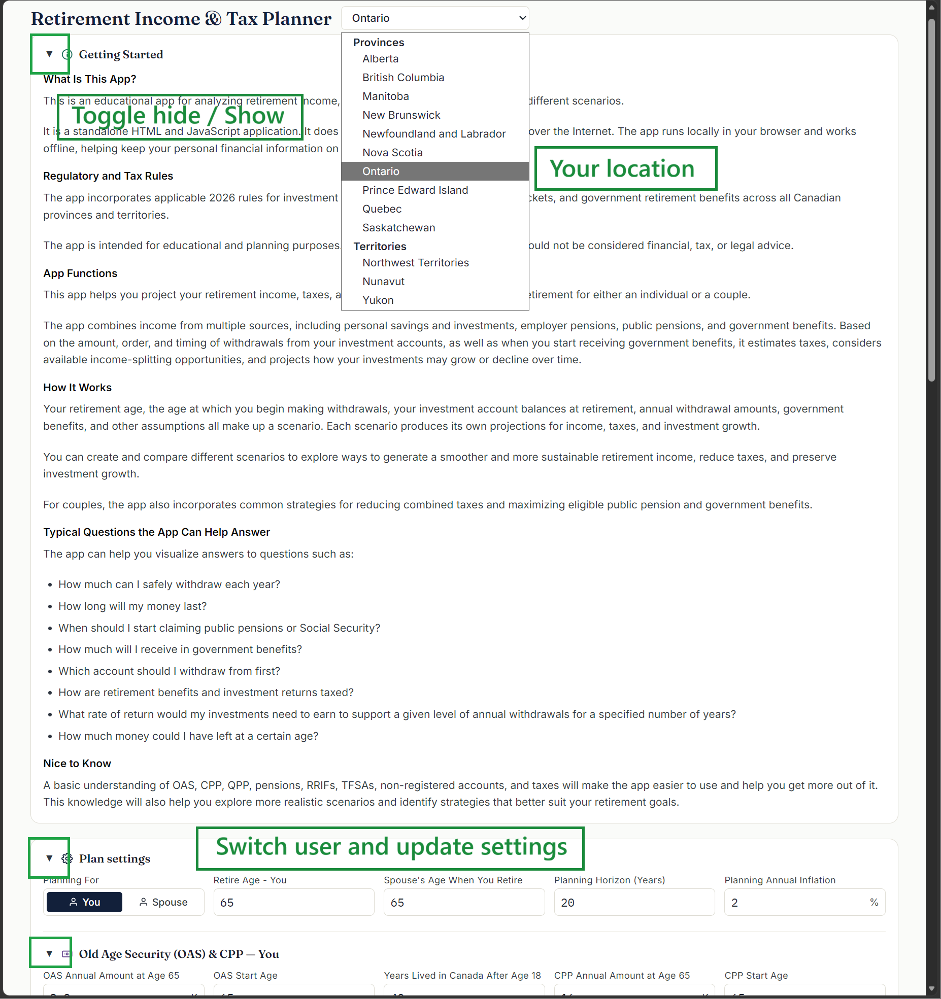
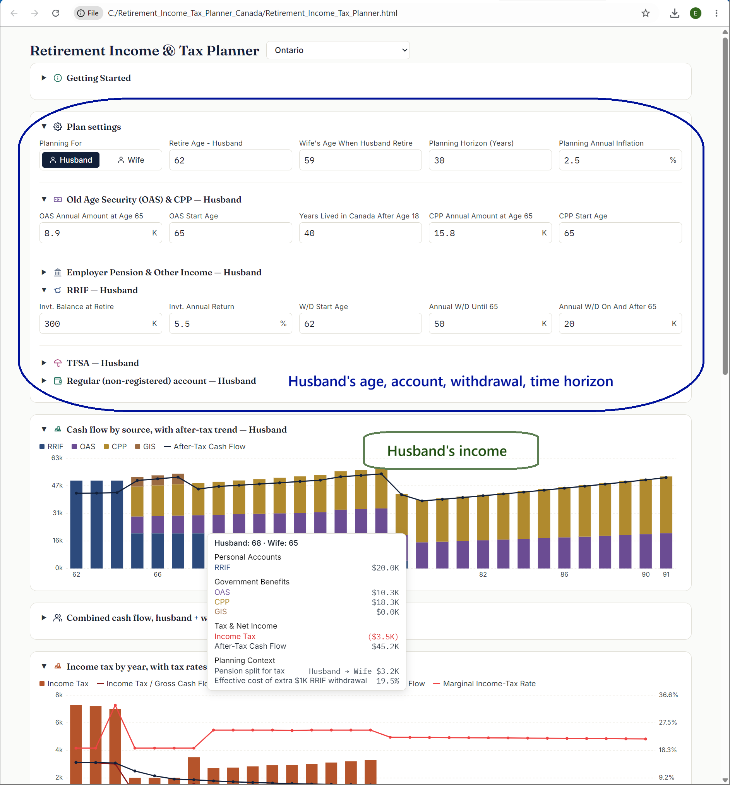
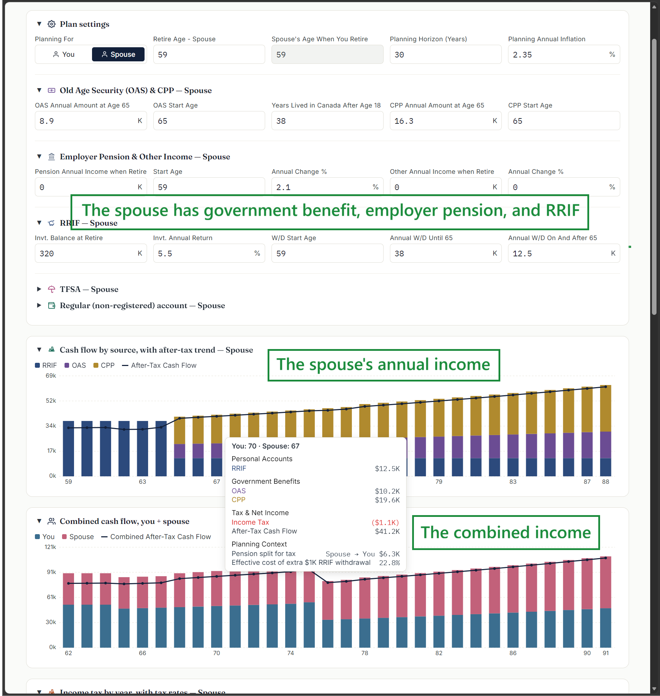
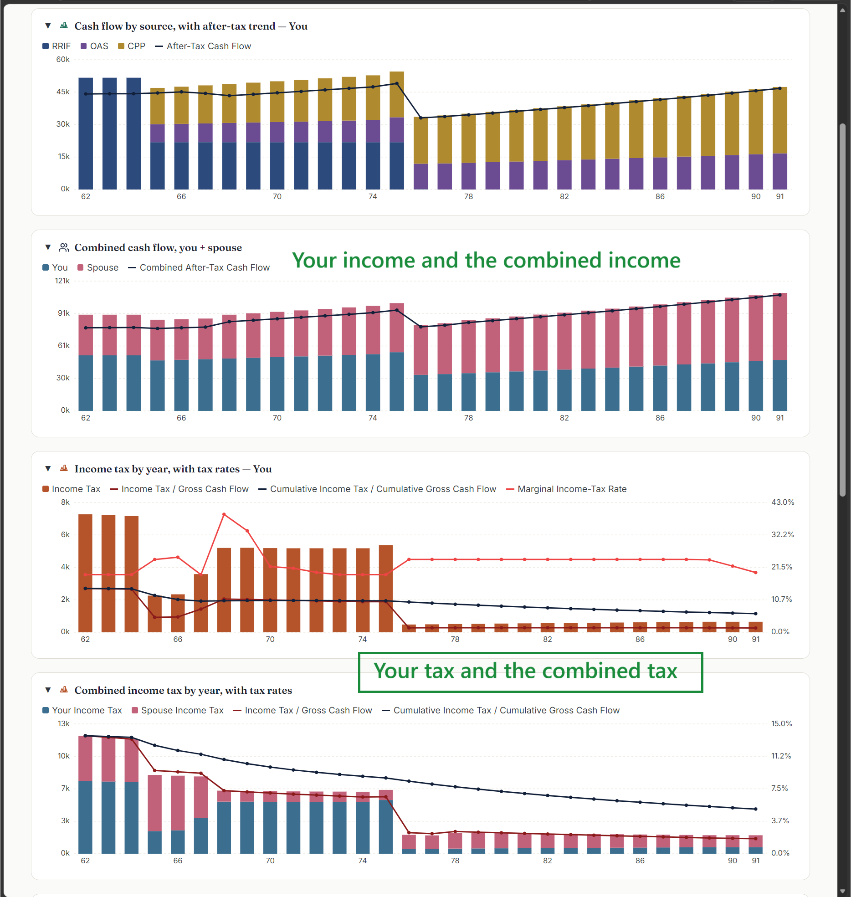
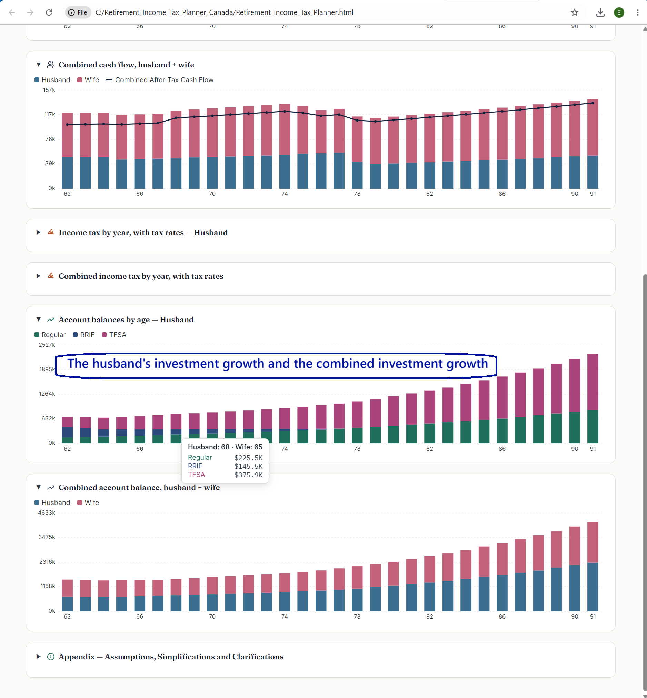

# retirement_income_tax_planner_Canada
Canadian retirement income, tax, and investment scenario analysis tool for educational use.

# Retirement Income & Tax

**Retirement Income & Tax** is an educational application for exploring retirement income, taxes, government benefits, and investment-account withdrawal strategies in Canada.

The app combines income from multiple sources, including personal savings and investments, employer pensions, public pensions, and government benefits. Based on the amount, timing, and order of withdrawals from investment accounts, as well as when government benefits begin, it estimates taxes and projects how investments may grow or decline over time.

## What the App Does

The app can help users explore retirement scenarios involving:

* RRIF withdrawals
* TFSA withdrawals
* Non-registered investments
* Employer pensions
* CPP or QPP
* OAS and other government benefits
* Federal and provincial/territorial income taxes
* Income splitting where applicable
* Investment growth over time
* Different retirement-income strategies

The purpose is to help users compare scenarios and better understand how different retirement decisions may affect taxes, income, and investment balances.

## Who It Is For

The app is intended for people who want to explore their retirement finances and better understand how different income sources interact.

A basic understanding of OAS, CPP, QPP, pensions, RRIFs, TFSAs, non-registered accounts, and taxes will make the app easier to use and help users explore more practical scenarios.

## Privacy

The application runs locally in your web browser.

It does not require you to upload your financial information to a server for calculation, and it can be used offline after it has been downloaded.

## Screenshots

### Main Screen

### The husband's settings

### The wife's settings

### Income and Tax Results

### Income and Investment Projection

## Download and Run

Download the latest release from the repository's **Releases** section.

1. Open the latest release.
2. Download the ZIP file.
3. Extract the ZIP file to a folder.
4. Open `Retirement_Income_Tax_Planner.html` in a modern web browser.

No installation is required.

The application runs locally in your browser and can be used offline after download.

## Feedback and Bug Reports

Feedback is welcome.

If you find a bug, notice an incorrect calculation, or have a suggestion for improvement, please open an **Issue** in this GitHub repository.

When reporting a problem, please include:

* what you entered;
* what happened;
* what you expected to happen;
* your province or territory, if relevant;
* your browser and device; and
* a screenshot, if useful.

Please do not include sensitive personal or financial information in GitHub Issues.

## Important Disclaimer

This application is provided for educational, informational, and retirement-planning scenario analysis purposes only.

It does not provide financial, investment, tax, accounting, legal, or retirement-planning advice. Calculations are estimates based on assumptions and may differ from actual results.

See [`DISCLAIMER.md`](DISCLAIMER.md) for the full disclaimer.

## License

This software is made available under the **PolyForm Noncommercial License 1.0.0**.

Commercial use is not permitted except as allowed by the license or with separate written permission from the copyright holder.

See [`LICENSE`](LICENSE) for the full license terms.

## Status

This project is under active development. Calculations, assumptions, and features may change as the application is tested and improved.
